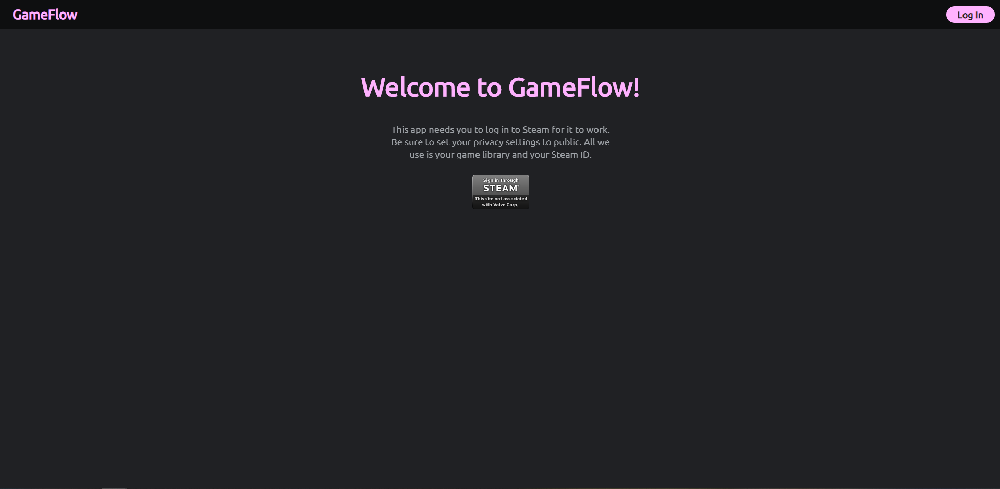

# GameFlow 

GameFlow solves the choice paralysis problem many gamers encounter when trying
to decide what to play next. Users can simply log into their Steam accounts and
take a short quiz, and GameFlow gives them a suggestion. Users can also save favorite 
games for future use.

http://secret-wildwood-10554.herokuapp.com/

## Table of Contents

- [Installation](#installation)

- [Usage](#usage)

- [Technologies](#technologies)

- [License](#license)

- [Questions](#questions)

## Installation

Click the link above to see the deployed site, or clone my repository to check
out my code!

## Usage

Just log in with your Steam account and take the quiz!

## Technologies

React: https://reactjs.org/

Passport: http://www.passportjs.org/

Grommet: https://v2.grommet.io/

Express.js: https://expressjs.com/

MongoDB: https://www.mongodb.com/

Mongoose: https://mongoosejs.com/docs/

Node.js: https://nodejs.org/en/

Steam Web API: https://steamcommunity.com/dev

RAWG API: https://rawg.io/apidocs

## License

Copyright 2020 Charles McRae Peavy

Permission is hereby granted, free of charge, to any person obtaining a copy of
this software and associated documentation files (the "Software"), to deal in
the Software without restriction, including without limitation the rights to
use, copy, modify, merge, publish, distribute, sublicense, and/or sell copies of
the Software, and to permit persons to whom the Software is furnished to do so,
subject to the following conditions:

The above copyright notice and this permission notice shall be included in all
copies or substantial portions of the Software.

THE SOFTWARE IS PROVIDED "AS IS", WITHOUT WARRANTY OF ANY KIND, EXPRESS OR
IMPLIED, INCLUDING BUT NOT LIMITED TO THE WARRANTIES OF MERCHANTABILITY, FITNESS
FOR A PARTICULAR PURPOSE AND NONINFRINGEMENT. IN NO EVENT SHALL THE AUTHORS OR
COPYRIGHT HOLDERS BE LIABLE FOR ANY CLAIM, DAMAGES OR OTHER LIABILITY, WHETHER
IN AN ACTION OF CONTRACT, TORT OR OTHERWISE, ARISING FROM, OUT OF OR IN
CONNECTION WITH THE SOFTWARE OR THE USE OR OTHER DEALINGS IN THE SOFTWARE.

## Questions

Reach out to me through email or on GitHub!

### Github

https://github.com/mcraepv

### Email

mcraepv@gmail.com
